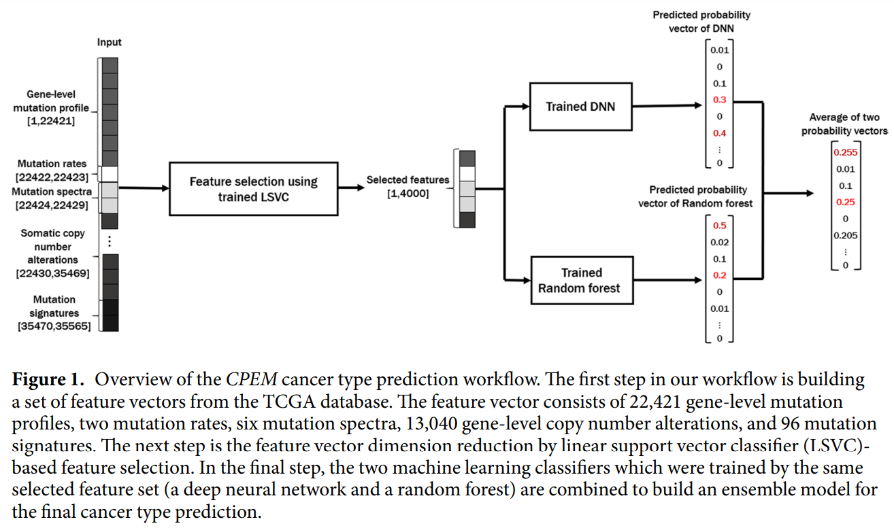
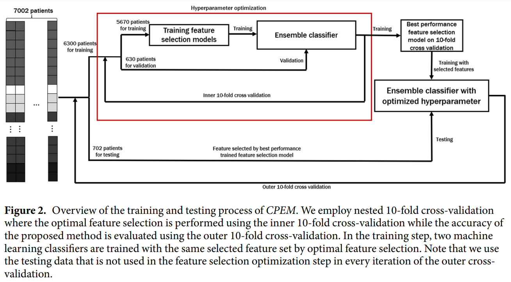
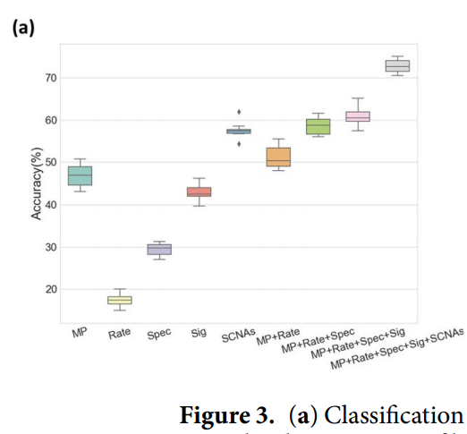
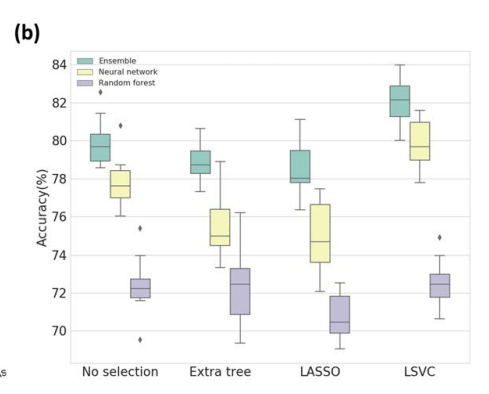
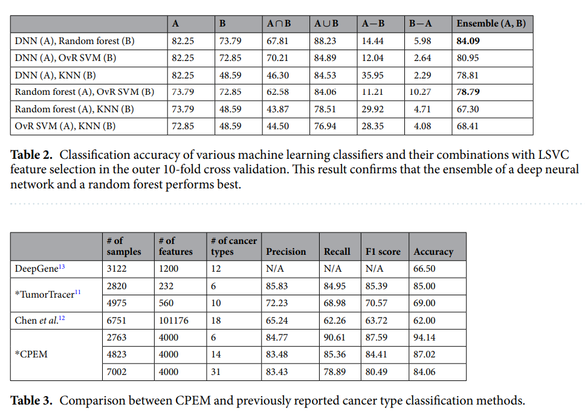

# CPEM: Accurate cancer type classification based on somatic alterations using an ensemble of a random

keywords: cancer, classification, ensemble   
type: 논문 리뷰   
기수: 1기   
기술 분류: 신약개발   
날짜: 2020년 10월 18일   
스터디 그룹: 대회참가\(신약개발\)   
작성자: Chanran Kim

## Abstract

* DNA sequencing technologies → 대규모 genomic data의 빠른 수집 → commonplace
* the classification of cancer type
  * based on somatic alterations\(체세포 변화\) detected from sequencing analyses
* In this study,
  * evaluate the contributions of various input features
    * such as,
      * mutation profiles
      * mutation rates
      * mutation spectra
      * signatures
      * somatic copy number alternations \(can be derived from genomic data\)
  * utilize them for accurate cancer type classification
  * CPEM \(Cancer Predictor using an Ensemble Model\)
  * tested on 7,002 samples representing over 32 different cancer types \(TCGA DB\)
  * feature selection - relatively high importance
  * 84% accuracy \(nested 10-fold CV\) → 94% accuracy \(narrow down the target cancers to the six most common types\)

## Introduction

### Workflow

1. feature vector 만들기
   * 22,421 gene-level mutation profiles
   * 2 mutation rates
   * 6 mutation spectra
   * 13,040 gene-level copy number alterations
   * 96 mutations signatures
2. dimension reduction
   1. LSVC\(Linear Support Vector Classifier\) based feature selection
3. train DNN, RandomForest → predict by Ensemble \(Average\)

## Results

### Experimental setup

* DNN
  * MLP
    * multinomial class cross-entropy w/ softmax loss
    * ReLU activation function
    * 3 layers \(hidden\_size: 2048\)
    * Adam
    * lr: 1e-5
    * dropout: 40%

* 입력 feature의 optimal한 수와 feature selection 방법을 inner 10-fold CV에 대한 accuracy를 최대화하는 값으로 선택한다. Feature selection이 확정되면, 독립적인 테스트셋을 사용하여 CPEM 성능을 테스트

### Efficacy of Various Mutation Features

* random forest classifier → initial prediction model
* measure changes in classification performance as each feature was added using 10-fold CV
  * gene-level mutation profiles \(46.9%\) + mutation rates \(51.2%\) + mutation spectra \(58.5%\) + gene-level SCNAs \(61.0%\) + mutation signatures \(72.7%\)
    * ~~특별히 무슨 관계가 있다기 보다는 결국 다 넣는게 젤 좋은거 아닌가요...? 어떤 점을 특별히 발견한 것인지 잘 모르겠습니다.~~

* select the top ten features based on the importance score from the classifier
  * 2 x mutation rates \(2/2\)
  * 1 x mutation signature \(1/96\)
  * 2 x mutation spectra \(2/6\)
  * 5 x mutated genes \(5/22,421?\)
* This result is consistent with previous studies that identified distinct mutational landscapes from many different types of cancer genomes
* This result confirms that genetic features play an important role in cancer initiation and progression, and also contribute to improving the accuracy of cancer classification

### Optimal Feature Selection

* Feature Selection으로 10%만 선택 \(크기를 90% 줄임\)
* extra tree-based → random forest classifier
* LASSO, LSVM → DNN

## Discussion

* kNN은 성능이 심각
  * 이런건 섞지 않는게 나음

## Methods

### Feature Selection

* Tree-based feature selection
  * feature importance calculated during the training of the decision tree classifier
* Lasso feature selection
  * w: regression coefficient vector
  * w는 입력 특성 xi를 필터링하기 위한 importance값으로 사용
  * w가 sparse하면 적은 features가 선택되고, 반대의 경우도 마찬가지.
* LSVC feature selection
  * squared hinge loss w/ L1-norm sparsity term
  * minimization 후에는 각 클래스에 대한 w가 sparse하므로, 0이 아닌 w 요소를 수집해서 feature select

