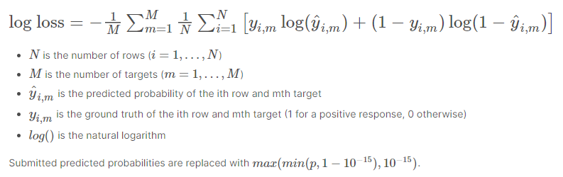
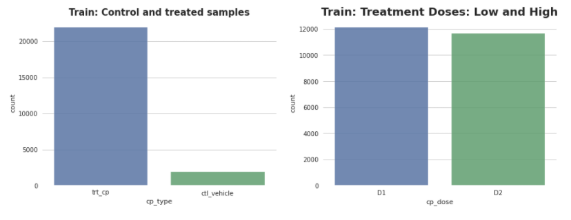
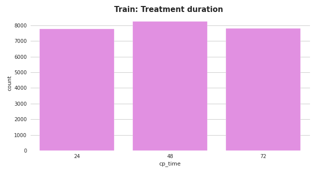
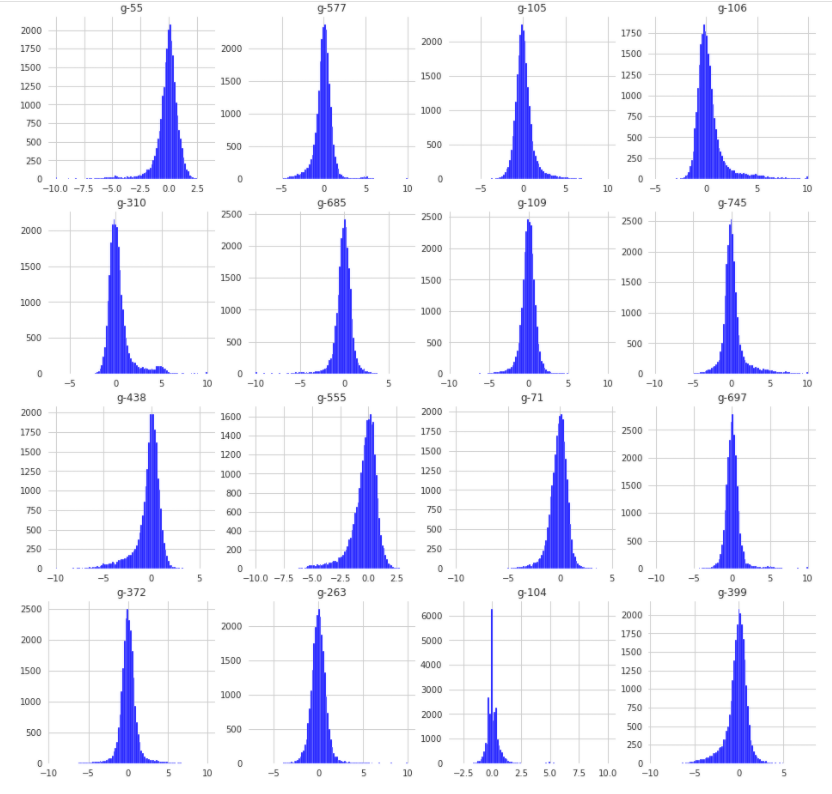
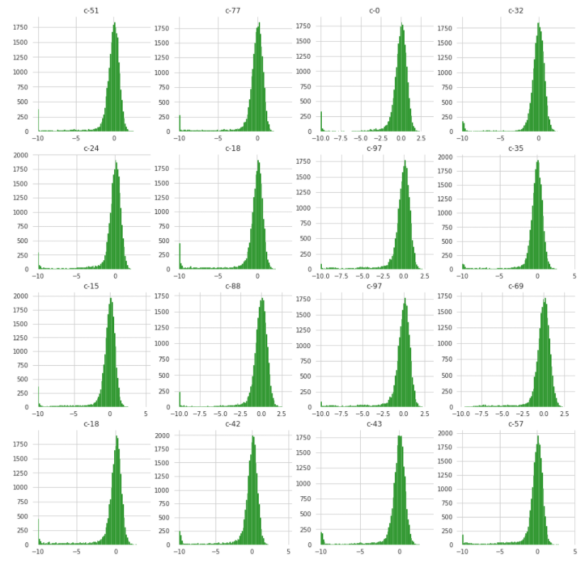
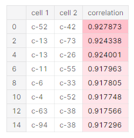
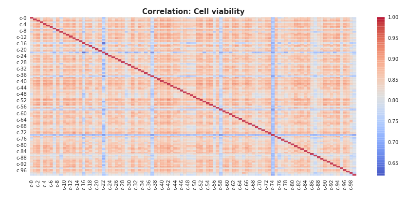

# Stacking & Blending

## 

**1.Stacking**

## Introduction

**스태킹\(Stacking\)** 또는 stacked generalization으로 알려진 기법입니다. 현실 모델에 적용하는 경우는 적으나, 대회에서 높은 순위를 위해 많이 사용된다.

**스태킹\(Stacking\)** 또는 stacked generalization으로 알려진 기법입니다.

* Silver Medal, 47th &lt;Paracetamol&gt; Team
* [kushal Agrawal](https://www.kaggle.com/kushal1506) 의 [MoA Prediction\|Complete Walkthrough\|EDA--&gt;Ensemble](https://www.kaggle.com/kushal1506/moa-prediction-complete-walkthrough-eda-ensemble)

가장 핵심 아이디어는 머신러닝 알고리즘으로 훈련 데이터셋을 통해 새로운 데이터셋을 만들고, 이를 데이터셋으로 사용하여 다시 머신러닝 알고리즘을 돌리는 것입니다. 보통은 _서로 다른 타입의 모델들_ 을 결합합니다.

현실 모델에 적용하는 경우는 적으나, 대회에서 높은 순위를 위해 많이 사용됩니다.

#### 이 노트북을 리뷰한 이유

스태킹에는 총 2가지 종류의 모델이 필요하다.

가장 핵심 아이디어는 머신러닝 알고리즘으로 훈련 데이터셋을 통해 새로운 데이터셋을 만들고, 이를 데이터셋으로 사용하여 다시 머신러닝 알고리즘을 돌리는 것입니다. 보통은 _서로 다른 타입의 모델들_ 을 결합합니다.

* 가장 핵심적인 EDA, Feature Engineering, Ensemble을 다루며, 내용이 풍부하기에 리뷰하였습니다.

1. 개별적인 기반 모델 : 성능이 비슷한 여러 개의 모델
2. 최종 메타 모델 : 기반 모델이 만든 예측 데이터를 학습 데이터로 사용할 최종 모델

스태킹에는 총 2가지 종류의 모델이 필요합니다.

#### Mechanisms of Action \(MoA\) 예측

다시 정리해서 말하면 여러 개의 개별 모델들이 생성한 예측 데이터를 기반으로 최종 메타 모델이 학습할 별도의 학습 데이터 세트와 예측할 테스트 데이터 세트를 재 생성하는 기법다.

1. 개별적인 기반 모델 : 성능이 비슷한 여러 개의 모델
2. 최종 메타 모델 : 기반 모델이 만든 예측 데이터를 학습 데이터로 사용할 최종 모델

* 이 대회에서는 유전자 발현과 세포 생존 정보를 바탕으로 신약의 작용 메커니즘을 결정하는 모델을 개발합니다. 이 대회에서는 5,000개 이상의 약물에 대한 MoA 주석 외에도 유전자 발현과 세포 생존 데이터를 결합한 고유 한 데이터 세트에 접근할 수 있습니다.

모델을 통해 input을 만들고, 다시 모델에 넣는 구조때문에 **meta-model** 이라고도 부른다.

다시 정리해서 말하면 여러 개의 개별 모델들이 생성한 예측 데이터를 기반으로 최종 메타 모델이 학습할 별도의 학습 데이터 세트와 예측할 테스트 데이터 세트를 재 생성하는 기법입니다.

#### Contents

1. Exploratory Data Analysis \(EDA\)
2. Feature Engineering
3. Models Ensemble

#### 2. Blending <a id="5-2-blending"></a>

#### Objective and Metrics

과정 자체는 거의 같습니다. 차이점이 있다면 Stacking에서는 cross-fold-validation을 사용하고, Blending은 holdout validation을 사용한다.

**Blending** 은 스태킹과 매우 유사한 방법입니다. 하지만 보다 간단하고, 정보누설의 위험을 줄입니다. 일부는 Stacking과 Blending을 혼용해서 사용합니다. \(대부분은 스태킹과 같은 의미로 사용하는 것 같습니다.\)

* 이것은 다중 레이블 이진 분류 문제이며, 평가에 사용되는 메트릭은 평균 열별\(column-wise\) 로그 손실입니다. 모든 행에 대해 표본이 각 목표에 대해 긍정적인 반응을 보일 확률을 예측해야합니다. N 개의 행과 M 개의 대상에 대해 NxM 개의 예측이 있습니다. 제출물은 로그 손실로 점수가 매겨집니다.

그렇기 때문에 Blending의 결과는 holdout set에 과대적합이 된 결과를 얻을 가능성이 높다.

과정 자체는 거의 같습니다. 차이점이 있다면 Stacking에서는 cross-fold-validation을 사용하고, Blending은 holdout validation을 사용합니다.



그렇기 때문에 Blending의 결과는 holdout set에 과대적합이 된 결과를 얻을 가능성이 높습니다.

## 1. Exploratory Data Analysis

### Overview: Features

* g-feature 유전자 발현\(expression\) 데이터를 나타냅니다.
* c-feature는 세포 생존\(viability\) 데이터를 의미합니다.
* cp\_type은 어떤 하나의 화합물로 처리 된 샘플을 나타내고, trt\_cp는 여러 화합물로 처리 된 샘플을 나타냅니다.
* cp\_vehicle 또는 제어 섭동\(ctrl\_vehicle\); 제어 섭동에는 MoA가 없습니다.
* cp\_time 및 cp\_dose는 치료 기간\(24, 48, 72 시간\) 및 용량\(높음 또는 낮음\)을 나타냅니다.

### 1\) **Train Features**

#### 범주 특징

* 3가지 범주 특징이 있습니다: 치료 시간, 용량 및 유형
* 우리는 다음의 사항을 관찰할 수 있습니다
  * 관찰 된 치료의 대부분은 두 데이터 세트에 대해 복합적인 반면 대조 섭동은 기차 테스트 세트에 대해 각각 7-8 %입니다. 훈련 테스트 세트간에 균형을 이룬다 고 말할 수 있습니다.
  * 치료 기간은 일반적으로 나머지 시간보다 약간 더 긴 48 시간으로 분산됩니다. 다시 말하지만 두 데이터 세트에 대해 상당히 균형이 잡혀 있습니다.
  * 용량은 균등하게 분배되고 첫 번째 선량은 두 데이터 세트에서 D2보다 약간 더 많으며 두 데이터 세트는 균형을 이룹니다.





#### 유전자 발현 및 세포 생존 특징

Number of gene features: 772 Number of cell features: 100

* Distribution of Genes: \(random choice를 보여줍니다\)



* Distribution of Cells: \(random choice를 보여줍니다\)



* 위 EDA의 관찰
  * 세포 및 유전자 생존력의 범위는 정수 0과 1 사이 여야합니다. 여기에서는 데이터가 z 점수가 매겨진 다음 Quantile normalization를 사용하여 정규화 되었기 때문에 -10 및 6 범위의 값을가집니다.
  * 높은 음성 세포 생존율 측정은 높은 살상 비율을 반영합니다. \([ref](https://www.kaggle.com/c/lish-moa/discussion/191487)\) 다시 말해:
    * 높은 음수 값 = 많은 수의 죽은 세포
    * 높은 양수 값 = 많은 수의 살아있는 세포
* Cells correlation
  * 세포 발현 특징간의 상관 관계를 살펴 보겠습니다. \(처리 된 샘플에서, 대조군 없음\)





* c-feature 사이의 많은 높은 상관 관계. 이것은 feature 엔지니어링에서 고려해야 할 사항입니다.


* Genes correlation
  * 유전자 발현 특징 간의 상관 관계를 살펴 보겠습니다. \(처리 된 샘플에서, 대조군 없음\)

    

    * 위의 c-feature correlation heatmap은 잘못 그린 것으로 생각됩니다.

    

  * g-feature 사이에서는 하나의 높은 상관 관계가 있습니다. 이것은 feature 엔지니어링에서 고려해야 할 사항입니다.

### 2\) Targets \(MoA\)

target features는 두 그룹으로 분류됩니다. 점수가 매겨진\(scored\) target 및 점수가 없는\(unscored\) target feature. 두 그룹의 feature는 이진값입니다. Competition 점수는 scored target feature을 기반으로하지만, unscored 그룹은 모델 평가, 데이터 분석 및 feature 엔지니어링에 계속 사용할 수 있습니다.

#### Scored Target

이것은 다중 라벨 분류이고, 우리는 207 MoA를 가지고 있으며 sig\_id 샘플에서 처리 된 5000 개의 약물의 작용 메커니즘을 찾아야합니다. 약물로 처리 된 단일 샘플은 많은 활성 표적\(active targets\)을 가질 수 있습니다. 즉, 하나의 약물이 하나 이상의 작용 메커니즘을 가질 수 있으므로 각 약물의 작용 메커니즘을 예측해야합니다.

저자는 train\_targets\_scored 데이터셋을 필터링하고 처리된 행만 유지합니다 \(제어행은 약물로 처리되지 않으므로 삭제합니다\).


* 모든 타겟이 하나 이상의 샘플에 있습니다.
* 타겟의 존재는 샘플에서 매우 낮습니다 \(대부분 0.75 % 미만\).
* 일부 대상 \(이상 값\)은 범위 \(3 %, 4 %\)의 백분율로 나머지 대상에 비해 더 많이 존재합니다.


* 여기에 nfkb\_inhibitor와 proteasome\_inhibitor의 2가지 특이값이 있는 것 같습니다.
* 플롯에서 억제제, 작용제, 길항제 등 많은 표적 레이블을 볼 수 있습니다.

#### Scored Target의 상관 관계


* 대부분의 목표는 상관 관계가 0입니다. 샘플에서 활성 표적의 존재가 매우 낮다는 것을 상기 할 가치가 있습니다 \(주로 샘플 당 1 개 또는 2 개의 표적\).
* 그러나 일부 대상 간에는 노란색 점 \(높은 상관 관계\)이 있습니다. 이 목표를 자세히 살펴 보겠습니다.

#### MoA 상관 관계가 가장 높은 Scored Target


#### 점수가 매겨지지 않은 대상에서 상당히 좋은 상관 관계를 찾을 수 있습니다.

* 이제 \(점수 대상 + 점수가없는 대상\) 즉 모든 대상의 상관 관계를 확인하겠습니다.


이 점수가 매겨지지 않은 데이터 세트는 유망해 보입니다.

참고 :-모든 대상은 전이 학습에 사용할 수 있습니다.

### 3\) Test features

* feature와 label 사이의 관계를 이해한 후 testset에서 feature와 train feature와의 관계를 이해합니다.


모든 것이 학습셋과 비슷해 보입니다.

* 복용량은 동일하게 적용됩니다.
* 제어 샘플이 거의 없습니다.
* 동일한 치료 기간 24 시간, 48 시간 및 72 시간

학습 데이터셋과 테스트 데이터셋은 실험 조건 측면에서 비슷합니다. 테스트셋에 사용된 샘플이 학습셋과 다르기 때문에 변이\(variation\)는 유전자 발현 및 세포 생존력에 있습니다.

그 샘플들이 얼마나 다른지 봅시다!

#### Gene expression


학습셋에서와 같이 일부 유전자 사이의 높은 양의 상관 관계와 음의 상관 관계를 볼 수 있습니다.

Test


Train


#### Cell Viability


* 테스트셋의 c-feature가 학습셋보다 더 나은 상관 관계를 가짐
* 세포 correlation의 순서는 testset에서 다릅니다!

### 4\) Drug IDs

Train\_drug.csv에는 학습셋에있는 모든 signature ID의 익명 약물 ID가 포함됩니다. 3289개의 고유한 약물이 있으며 23814 개의 고유한 signature가 있습니다. 이는 일부 약물이 6회 이상 사용됨을 의미합니다 \(2 회 다른 용량 x 3 회 상이한 기간\). 이 데이터는 교차 검증 및 이상 값 탐지에 유용 할 수 있습니다.

#### 가장 빈번한 약물 :


* 관찰
  * 3700개 약물 중 2774개 약물에는 2회 용량과 3 회 치료 시간에 해당하는 6 개의 행이 있습니다.
  * 64개의 약물에만 12개의 샘플이 있으며, 더 많은 약물이 두 번 프로파일 링 될 것으로 예상했습니다.
  * 3 개의 약물에만 18 개의 샘플이 있으며 약물은 3 번 프로파일링되었습니다.

### 5\) EDA의 결론

* 학습 및 테스트셋은 동일한 분포를 공유합니다.
* c-feature는 서로 높은 상관 관계가 있습니다 \(새로운 feature를 만드는 데 사용할 수 있음\).
* 데이터가 상당히 왜곡되어\(skewed\)있어서, 일부를 통계 feature도 생성 할 수 있습니다.
* Drug\_id는 이 항목에서 설명한대로 교차 유효성 검사 전략에서 중요한 역할을 할 수 있습니다. 제출에 사용한 교차 검증 전략은 다중 레이블 계층화된\(Multi-label stratified\) Kfold입니다.
* 모든 targets은 상관 관계가 높으며 전이 학습에 사용할 수 있습니다.
* 약 71 개의 non-scored targets는 행동 메커니즘이 없으므로 사전 훈련 중에 떨어 뜨릴 수 있습니다.

## 2. Feature Engineering

#### 적대적 검증 및 특징 중요도

적대적 검증\(Adversarial Validation\)에 대해 자세히 알아 보려면-&gt; [PAGE](https://towardsdatascience.com/adversarial-validation-ca69303543cd) \| [YouTube](https://www.youtube.com/watch?v=7cUCDRaIZ7I&feature=youtu.be)

범주적 특징; cp\_type, cp\_time 및 cp\_dose는 적대적 유효성 검사에서 생략됩니다. 유전자 발현 및 세포 생존 feature만 사용됩니다. 기본적으로 두 데이터셋\(학습의 경우 0, 테스트의 경우 1\)에 대한 target을 교체 한 다음 어떤 관측 값이 학습셋에 속하는지, 어떤 관측 값이 테스트셋에 속하는지 예측하는 분류기를 구축합니다. 유사한 루트에서 무작위로 데이터 세트를 선택한 경우 분류기가 이를 분리하기가 정말 어렵습니다. 그러나 학습셋과 테스트셋간에 체계적인 선택 차이가있는 경우 분류기는 이러한 추세를 포착 할 수 있어야합니다. 따라서 다음 섹션 \(0.50 AUC\)에서 모델 점수를 낮추기를 원합니다. 감지율이 높을수록 학습 데이터 세트와 테스트 데이터 세트 간의 차이가 더 커지기 때문입니다. 시작하겠습니다.

```text
LightGBM Adversarial Validation Model Mean ROC AUC Score 0.525976 [STD:0.0122109]
LightGBM Adversarial Validation Model OOF ROC AUC Score: 0.524054
```


적대적 검증 모델은 약 0.525 ROC AUC 점수를 산출하여 학습 및 공개 테스트셋이 유사함을 나타냅니다. 중요도 플롯의 맨 위에 있는 특징은 분포 꼬리 끝\(distribution tail extremities.\)으로 인해 학습 및 공개 테스트셋에서 다른 수단을 갖기 때문에 더 높은 이득을 얻습니다. 이는 공개 테스트셋의 작은 샘플 크기와 관련이있을 수 있으며 반드시 비공개 테스트셋에서 예상 할 필요는 없습니다.

#### Feature Scaling

이전 그래프에서 continuous feature가 서로 다른 범위에 있음을 알 수 있습니다. Feature scaling은 모델 성능을 향상시키고 수렴 속도를 동시에 높일 수 있습니다. 이 competition에서 Quantile Transformer는 GENE 및 CELL feature의 스케일링에 중요한 역할을했습니다. 이 방법은 특징을 균일 또는 정규 분포를 따르도록 변환하기 때문입니다. 따라서 주어진 특징에 대해이 변환은 가장 빈번한 값을 분산시키는 경향이 있습니다. 이것은 또한 \(한계\) 이상치의 영향을 줄여줍니다: 따라서 이것은 강력한 전처리 체계입니다. 0 중심 데이터는 PCA와 같은 알고리즘에서 더 잘 수행되는 반면, 최소 최대 스케일 데이터는 신경망에서 더 잘 수행 될 수 있습니다.

최소 최대 스케일러 및 표준 스케일러는 이상치의 영향을 많이 받지만 가우스 순위 스케일러는 더 강력한 결과를 산출합니다. 가우스 순위 척도 데이터는 다른 데이터와 달리 symmetrical tails를 갖습니다.

Quantile Normalization에 대한 흥미로운 동영상: [https://www.youtube.com/watch?v=ecjN6Xpv6SE](https://www.youtube.com/watch?v=ecjN6Xpv6SE)


Quantile Transformation을 적용하면 학습셋에서 얻은 Uniformity를 쉽게 확인할 수 있습니다.


#### 차원 축소 \(PCA\)

> PCA는 데이터를 다른 공간으로 투영하는 선형 변환입니다. 여기서 투영 벡터는 데이터의 분산으로 정의됩니다. PCA 결과는 재구성 오류 및 누적 백분율 분산으로 평가할 수 있습니다.

유전자 및 세포의 PCA에 대한 최적의 구성 요소 수를 찾으려면 [이 노트북](https://www.kaggle.com/kushal1506/deciding-n-components-in-pca)을 참조하십시오.

* n\_comp = 600 \# for g-feature
* n\_comp = 50 \# for c-feature

#### Variance Threshold

> Feature selection을 위한 또 다른 접근 방식은 미리 정의된 임계값보다 분산이 낮은 feature를 제거하는 것입니다. 분산은 평균과 차이를 제곱 한 평균이므로 데이터 포인트가 평균에서 얼마나 멀리 떨어져 있는지 측정합니다. 분산이 낮거나 0에 가까우면 feature가 거의 일정하며 모델의 성능이 향상되지 않습니다. 이 경우 제거해야합니다.

* mask = \(train\_features\[c\_n\].var\(\) &gt;= 0.85\).values \# 1527 → 1028개로 줄어듬

#### K-Means Clustering

> K- means의 목표는 간단합니다. 유사한 데이터 포인트를 함께 그룹화하고 기본 패턴을 발견합니다. 이 목표를 달성하기 위해 K- means는 데이터셋에서 고정 된 수\(k\)의 클러스터를 찾습니다. 데이터셋에 필요한 중심\(centroid\) 수를 나타내는 목표 수 k를 정의합니다. 중심은 클러스터의 중심을 나타내는 가상 또는 실제 위치입니다. 모든 데이터 포인트는 클러스터 내 제곱합을 줄임으로써 각 클러스터에 할당됩니다. 즉, K-means 알고리즘은 k개의 중심을 식별 한 다음 모든 데이터 포인트를 가장 가까운 클러스터에 할당하고 중심을 가능한 한 작게 유지합니다. K- means의 '평균'은 데이터의 평균을 나타냅니다. 즉, k개의 중심을 찾는 것입니다.

* 이것은 다중 레이블 문제이므로 K-means을 적용하면 도움이 될 수 있습니다.
* 다음은 K- 평균 클러스터링을 참조하는 짧은 비디오입니다. [YouTube](https://www.youtube.com/watch?v=4b5d3muPQmA&t=0s&index=2&list=PLlcyUWQOcKAgDvemP5qJp0kcvWU5n-d7V)
* n\_clusters\_g = 22
* n\_clusters\_c = 4

#### 통계적 feature 사용하기

```text
gsquarecols=['g-574','g-211','g-216','g-0','g-255','g-577','g-153','g-389','g-60','g-370','g-248','g-167','g-203','g-177','g-301','g-332','g-517','g-6','g-744','g-224','g-162','g-3','g-736','g-486','g-283','g-22','g-359','g-361','g-440','g-335','g-106','g-307','g-745','g-146','g-416','g-298','g-666','g-91','g-17','g-549','g-145','g-157','g-768','g-568','g-396']

def fe_stats(train, test):
    
    # statistical Features
    
    features_g = GENES
    features_c = CELLS
    
    for df in train, test:
        df['g_sum'] = df[features_g].sum(axis = 1)
        df['g_mean'] = df[features_g].mean(axis = 1)
        df['g_std'] = df[features_g].std(axis = 1)
        df['g_kurt'] = df[features_g].kurtosis(axis = 1)
        df['g_skew'] = df[features_g].skew(axis = 1)
        df['c_sum'] = df[features_c].sum(axis = 1)
        df['c_mean'] = df[features_c].mean(axis = 1)
        df['c_std'] = df[features_c].std(axis = 1)
        df['c_kurt'] = df[features_c].kurtosis(axis = 1)
        df['c_skew'] = df[features_c].skew(axis = 1)
        df['gc_sum'] = df[features_g + features_c].sum(axis = 1)
        df['gc_mean'] = df[features_g + features_c].mean(axis = 1)
        df['gc_std'] = df[features_g + features_c].std(axis = 1)
        df['gc_kurt'] = df[features_g + features_c].kurtosis(axis = 1)
        df['gc_skew'] = df[features_g + features_c].skew(axis = 1)
        
        # Using pair of highly correlative features
        
        df['c52_c42'] = df['c-52'] * df['c-42']
        df['c13_c73'] = df['c-13'] * df['c-73']
        df['c26_c13'] = df['c-26'] * df['c-13']
        df['c33_c6'] = df['c-33'] * df['c-6']
        df['c11_c55'] = df['c-11'] * df['c-55']
        df['c38_c63'] = df['c-38'] * df['c-63']
        df['c38_c94'] = df['c-38'] * df['c-94']
        df['c13_c94'] = df['c-13'] * df['c-94']
        df['c4_c52'] = df['c-4'] * df['c-52']
        df['c4_c42'] = df['c-4'] * df['c-42']
        df['c13_c38'] = df['c-13'] * df['c-38']
        df['c55_c2'] = df['c-55'] * df['c-2']
        df['c55_c4'] = df['c-55'] * df['c-4']
        df['c4_c13'] = df['c-4'] * df['c-13']
        df['c82_c42'] = df['c-82'] * df['c-42']
        df['c66_c42'] = df['c-66'] * df['c-42']
        df['c6_c38'] = df['c-6'] * df['c-38']
        df['c2_c13'] = df['c-2'] * df['c-13']
        df['c62_c42'] = df['c-62'] * df['c-42']
        df['c90_c55'] = df['c-90'] * df['c-55']
        df['c26_c38'] = df['c-26'] * df['c-38']
        df['c90_c13'] = df['c-90'] * df['c-13']
        df['c85_c31'] = df['c-85'] * df['c-31']
        df['c63_c42'] = df['c-63'] * df['c-42']
        df['c94_c11'] = df['c-94'] * df['c-11']
        df['c94_c60'] = df['c-94'] * df['c-60']
        df['c55_c42'] = df['c-55'] * df['c-42']
        df['g37_c50'] = df['g-37'] * df['g-50']
        
        # Making Polynomial Features
        
        for feature in features_c:
             df[f'{feature}_squared'] = df[feature] ** 2     
                
        for feature in gsquarecols:
            df[f'{feature}_squared'] = df[feature] ** 2        
        
    return train, test

train_features2,test_features2=fe_stats(train_features2,test_features2)
```

#### MoA 없는 non-scored targets 71 개 추출 및 제거

## 3. Ensemble

### 1\) Pytorch Pre-train \(Using Predictions on Non-scored Targets as Meta-Features\)

#### Label Smoothing

> 간단히 말해서 라벨 스무딩은 모델을 더욱 강력하게 만들어 일반화 할 수 있도록하는 방법입니다. 이 대회에서 라벨 스무딩은 LB를 높이고 모델을 개선하는 데 중요한 역할을했습니다. 이 커널은 Inference 커널이므로 이 커널에서는 라벨 스무딩을 사용하지 않습니다.

라벨 평활화에 대해 더 잘 이해하려면 [이 페이지](https://medium.com/@nainaakash012/when-does-label-smoothing-help-89654ec75326)를 참조하십시오.

참고: Label Smoothing은 검증 손실 특징이 아닌 학습 손실 특징에 적용됩니다.

### 2\) Pytorch Transfer learning \(Using All Targets\)

* 설명이 없음. 그냥 ResNetModel...

### 3\) Tabnet-1 and Tabnet-2

About Tabnet: [Discussion-What can TabNet see!](https://www.kaggle.com/c/lish-moa/discussion/194203)

* inference 커널이다보니 tabnet-1과 tabnet-2의 차이가 코드로 보이지X

### 4\) ensemble weights

#### 이러한 가중치는 수동으로 결정됩니다.

```text
predictions_ = 0.25*preds_pretrain + 0.25*preds_tabnet_1 + 0.25*preds_transfer + 0.25*preds_tabnet_2
```

OOF-점수의 다른 모델을 기반으로 가중치를 결정하려면 [이 커널](https://www.kaggle.com/gogo827jz/optimise-blending-weights-with-bonus-0)을 참조하십시오.

## End Notes

Kaggle은 항상 배우고 성장하는 데 활용할 수있는 대회를 위해 많은 날을 제공합니다. 약속대로 설명과 함께 첫 번째 모델을 발표했으며 모든 코드가 그들의 코드에서 나오기 때문에 spacy의 문서와 Rohit singh의 커널을 읽을 수 있습니다. 당신은 코드의 어떤 부분을 이해하고 자유롭게 의견을 말하고 물어보십시오. 나는 그것을 해결하려고 노력할 것입니다.

큰 사랑과 감사를 전하는 Kaggle Community에 감사드립니다. 나는 당신이 내 커널을 좋아하기를 바랍니다. upvote는 내 노력을 계속 개선하고 친절하게 보여줄 에너지로 나를 채우는 감사와 격려의 몸짓입니다 ;-\)

#### 리뷰어의 리뷰

* EDA와 Feature Engineering의 측면에서 개념에 대한 간단한 설명과 분석 및 사용 이유에 대해 설명해준 점이 좋았다. 유사한 다른 대회에 참여할 때 takeover할 점이 많아 보인다.
* 하지만, inference kernel이라서 그런지, 모델에 관한 내용은 설명이 부실했다. ensemble에서 모델들을 그저 불러와서 inference하였기에 학습과정에 대해서 이해하기에는 부실했으며, 특히 transfer learning이라는 타이틀 아래에 있던 모델은 어떠한 측면에서 transfer인지조차 이해되지 않았다. 코드에 학습이 따로 포함되어있지 않았기 때문에 더욱 그러하다.

## Takeover

* feature correlation을 trainset과 testset에서 각각 구하고, 그 결과가 차이가 나는지 분석
  * 여기서는 이러한 분석을 함
    * 테스트셋의 c-feature가 학습셋보다 더 나은 상관 관계를 가짐
    * c-feature correlation의 순서는 testset에서 다릅니다!
  * correlation이 높았던 feature는 곱해서 feature를 더 만듬!
* Adversarial Validation \(?\)
* Feature scaling - Quantile Transformer
  * 0 중심 데이터는 PCA와 같은 알고리즘에서 더 잘 수행되는 반면, 최소 최대 스케일 데이터는 신경망에서 더 잘 수행 될 수 있습니다.
* Variance Threshold로 feature selection
* skewed data? → statistical feature!

